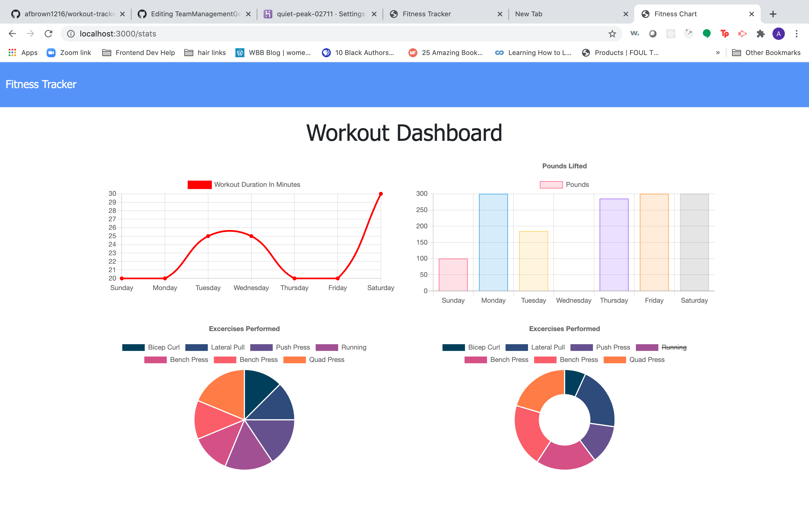

# Workout-tracker

## Description 

An app that tracks your workouts including resitance and carido workouts. This app features express, mongodb, and mongoose. Check it out here [here](https://quiet-peak-02711.herokuapp.com/)

## Usage 

Below is an image of the dashboard which displays stats for workouts over time. 

    

This image display the front page which features stats for your last workout. 

    

## Questions
 Please forward any questions to [email(fay.ashbrgmail.com) . Please refer to the code for this project and others at [https://github.com/afbrown1216](https://github.com/afbrown1216).

## License 

Copyright (c) afbrown1216. 
Licensed under the MIT license.